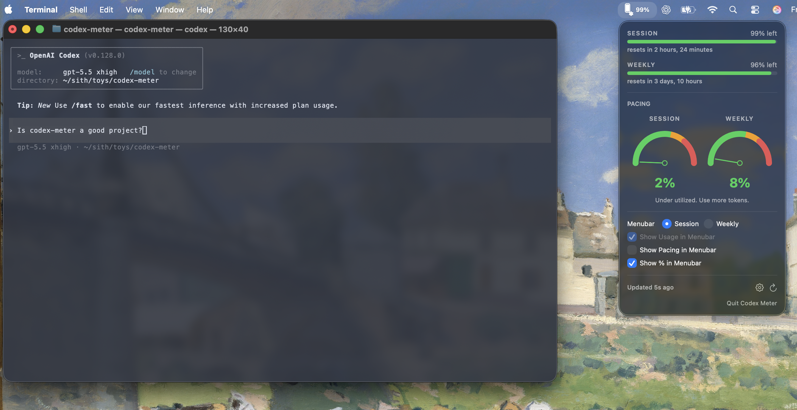

# codex-meter

A macOS menu bar app that displays Codex subscription usage.



A fork of [claude-meter](https://github.com/anthropics/claude-meter) targeting OpenAI's Codex CLI. Same battery-indicator UX, different backend.

## Requirements

- macOS 14 (Sonoma) or newer
- Xcode 15+ (build) — the Xcode command-line tools alone are not enough; the asset compiler and SwiftUI previews ship with full Xcode
- **Codex CLI installed and signed in.** codex-meter reads the bearer token Codex CLI caches at `~/.codex/auth.json`. Codex CLI does not need to be running; it just has to have completed `codex login` at least once. After that, codex-meter polls the same `wham/usage` endpoint Codex CLI itself uses for `/status`.

If you don't have Codex CLI: <https://developers.openai.com/codex>.

## Quickstart

```sh
git clone https://github.com/<your-fork>/codex-meter.git
cd codex-meter
./build.sh
```

`build.sh` runs `xcodebuild` (Release configuration, output pinned to `./build/` so it isn't lost in Xcode's hashed DerivedData) and then `open`s the app. Safe to re-run — incremental rebuilds are fast.

**First launch:** unlike claude-meter, there are no Keychain dialogs. Codex CLI stores its tokens in plaintext at `~/.codex/auth.json` (mode 0600), so codex-meter just reads the file. macOS may prompt for the usual notarization / unidentified-developer warning if the binary isn't signed.

The app has `LSUIElement=true`, so no Dock icon appears — look for the vessel icon in the menu bar (top-right of the screen). Click it for the popover; ⌘, opens the settings panel.

## Coexistence with claude-meter

codex-meter ships a different bundle ID (`dev.codexmeter.app`) and a visually distinct AppIcon (terracotta vessel + hexagonal Codex watermark) so the two can coexist in the menu bar. If you use both Claude and Codex, install both — each tracks its own subscription.

## From Xcode

If you'd rather build interactively:

```sh
open CodexMeter/CodexMeter.xcodeproj
```

Then hit ⌘R.

## Tests

```sh
xcodebuild -project CodexMeter/CodexMeter.xcodeproj \
           -scheme CodexMeter \
           -destination 'platform=macOS' test
```

## Layout

- `CodexMeter/` — Xcode project and app source
- `docs/` — architecture, metrics, UI, brand, API, auth, backlog
- `assets/` — brand assets (canonical icon SVG), `fixtures/` for parser test data, `screenshots/` for README images
- `tools/render-icon.swift` — re-renders the AppIcon set from the SVG spec
- `utils/extract-codex-token.sh` — prints the cached Codex CLI bearer token (for the `probe-codex-usage-api.sh` helper)
- `utils/probe-codex-usage-api.sh` — fetches the live `wham/usage` endpoint and saves a fresh fixture
